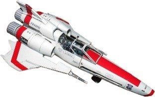
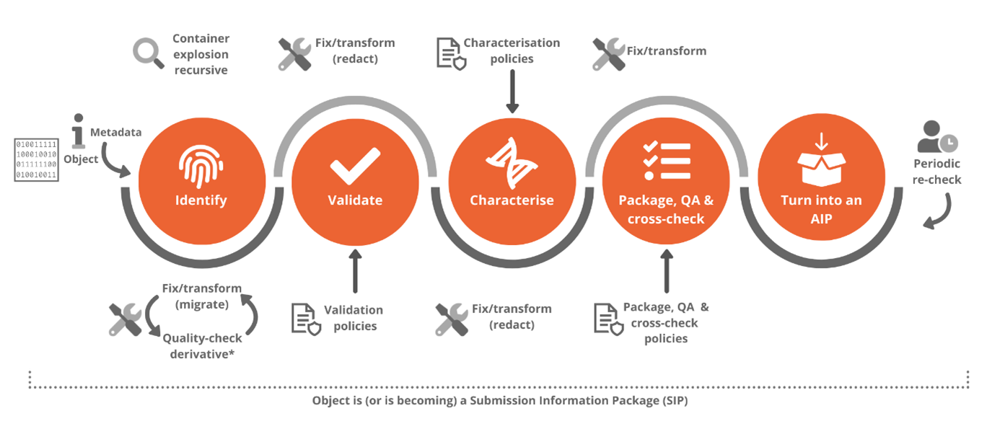
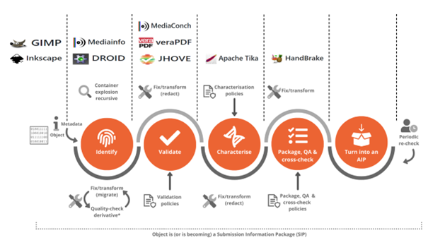

# ViPER 101: What, when, where, how

Hello there! Welcome to ViPER, your one-stop shop to traverse through the universe of digital preservation tooling.

Ideally, this is an environment where you'd experiment with your own or your organization's files. To set up a shared folder that allows file sharing between your computer and ViPER, please consult the [User's Guide](/guide/).

But not everyone has access to a test set. Therefore, you could also use:

## The OPF format-corpus

The OPF has developed a small openly-licensed corpus of example files that cover a wide range of formats and creation tools. Perfect for when you just want to test tools and play around with a variety of file formats without having to use your own! Go check it out at [GitHub - openpreserve/format-corpus](https://github.com/openpreserve/format-corpus): An openly-licensed corpus of small example files, covering a wide range of formats and creation tools.

But what if you're unsure of where to start and/or what to do?

## The OPF Reference Workflow

The OPF's tools address common issues facing many organisations. Together, they form a reference toolset for digital preservation which can be
adapted for use in different organisational workflows. They have defined a common workflow for digital preservation and mapped out where our open source products can fit within it. The workflow includes standard preservation actions, but the details, order of processing, and policies may differ by organisation. We focus on the ingest/pre-ingest subset of the OAIS model because our current products address these areas.

### A common workflow for digital preservation

Once a user has decided that a digital object should be preserved, the item needs to be catalogued and classified. This is as true with a digital object as a physical object. Each digital object has associated metadata stored alongside it, which must also be catalogued, classified, and stored. The process of cataloguing and classifying has several stages, including identification, validation and characterisation.

#### Identification

File format identification is a typical first step in a workflow. It answers the question: I have a digital object; what format is it?

The object may be a single file or a complex structure (such as a ZIP file) that contains other structured files and objects.

The process of identification will provide information about the object which may be as simple as a statement of the file format, variety and version. The information may also be more complex, such as a complete map of a complex container. All of this information can be recorded as metadata and added to the associated collection of metadata with the object.

#### Validation

Format validation is the process of determining an object's level of compliance with the relevant format specification. It answers the question: I have an object purportedly of format X; is it?

Format validation conformance is determined at three levels:

1. Well-formedness: A digital object is well-formed if it meets the purely syntactic requirements for its format.

2. Validity: An object is valid if it is well-formed and it meets the higher-level semantic requirements for format validity.

3. Consistency: An object is consistent if it is valid and its internally extracted representation information is consistent with externally supplied representation information

At the end of the validation process, the metadata that accompanies the digital object will be updated to include details of the validation, such as the policy choices made and the results of the conformance checking.

##### Characterisation

Format characterisation is the process of determining the format-specific significant properties of an object of a given format: I have an object of format F; what are its salient properties?

Characterisation also involves taking information about the digital object to build a richer context beyond its purely technical, structural details. For example, a word document usually records the author, the time of creation, the editing time, word count, and more, while a JPEG image file may carry information about the camera used to take it, time and day, and often even geolocation information. This information and the policy for this information to be extracted and duplicated outside the file is a key piece of metadata to be stored alongside the digital object.

##### Packaging, Cross-Check, Quality Assurance, Review

Finally, the digital object and the metadata gathered during identification, validation, and characterisation is prepared for storage. In this final stage of packaging, cross-checking, QA, and review, the digital object is formed and wrapped into an archival information package (AIP).

#### How ViPER tools (roughly) map to the OPF Reference Workflow

Below you can find a rough mapping of the OPF's tool to the workflow.

A more in depth mapping of the tools to the workflow is provided in a webinar that is accessible through YouTube:

<iframe width="560" height="315" src="https://www.youtube.com/embed/ASCSySOE5fE?si=fIaF6wDjnczQTAdP" title="YouTube video player" frameborder="0" allow="accelerometer; autoplay; clipboard-write; encrypted-media; gyroscope; picture-in-picture; web-share" referrerpolicy="strict-origin-when-cross-origin" allowfullscreen></iframe>

Now that you know which tool you can use with what goal in mind, you can use our Tool Reference Guide at <tools/> to find out more about each individual tool and how to use them.
